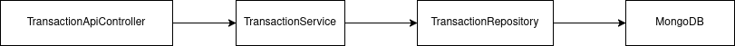

# Challenge Mendel
## Autor
- **Dante Finci**
- **Github:** Dantefinci18 
- **Email:** datalefi@gmail.com

## Requisitos
- Java 21
- Docker
- Docker compose v2+

## Arquitectura del proyecto


## Modelo de dominio
La entidad principal del sistema es `Transaction`, que representa una transacción almacenada en la base de datos.
```java
public class Transaction {
    private final long id;
    private final double amount;
    private final String type;
    private final Long parentId;
```
### Descripcion
- `id`: identificador único de la transacción
- `amount`: monto de la transacción
- `type`: tipo de transacción (ej: cars, shopping, etc.)
- `parentId`: referencia opcional a una transacción padre

## Compilación del proyecto
```bash
./mvnw clean package
```

## Ejecución de los tests
```bash
./mvnw test
```

## Ejecución del proyecto
### 1. Levantar Docker
```bash
docker compose up -d
```

### 2. Ejecutar la API
```bash
./mvnw spring-boot:run
```

### 3. Enlace al Swagger
[Swagger UI](http://localhost:8080/swagger-ui/index.html)

### 4. Detener servicios Docker
```bash
docker compose down
```